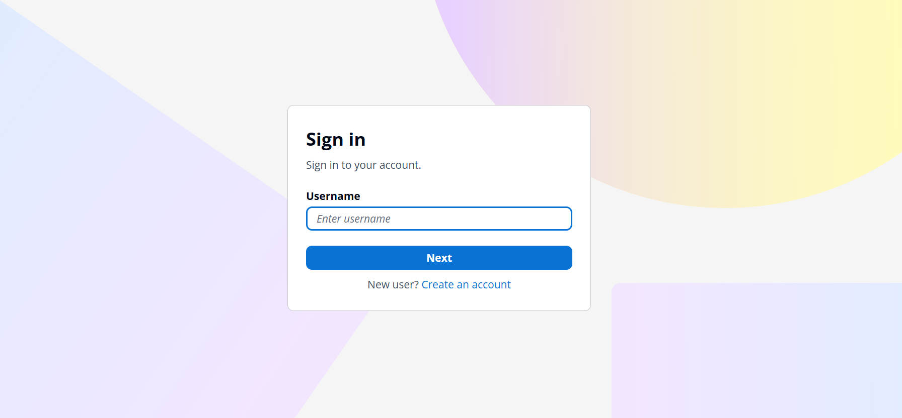
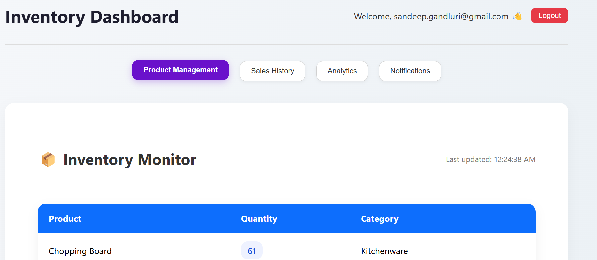
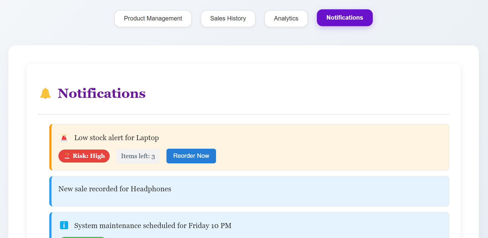

# RedTrack - Inventory Management System

RedTrack is a full-stack inventory management system designed for Target Corporation’s inventory managers. It provides real-time inventory tracking, dynamic sales simulation, low-stock notifications, and intuitive data visualization. The application is built with a modern tech stack and integrates AWS services for secure authentication and email notifications.

---

## 🚀 Features

- **Real-Time Inventory Tracking**: Monitor stock levels across multiple stores.
- **Dynamic Sales Simulation**: Scheduled tasks simulate product sales and update inventory.
- **Low-Stock Notifications**: Automated email alerts via AWS SES when inventory runs low.
- **Secure Authentication**: User authentication and authorization using AWS Cognito.
- **Intuitive Frontend**: React-based UI for managing products, viewing sales history, and analyzing trends.
- **Data Visualization**: Interactive charts for sales analytics using Recharts.

---

## 🛠️ Tech Stack

### 🔧 Backend

- **Framework**: Spring Boot  
- **Database**: PostgreSQL  
- **ORM**: Spring Data JPA  
- **Scheduling**: Spring Boot Scheduler  
- **Authentication**: AWS Cognito (Spring Security & OAuth2)  
- **Email Notifications**: AWS SES (AWS SDK for Java)  
- **Connection Pooling**: HikariCP  
- **Utilities**: Lombok  

### 💻 Frontend

- **Framework**: React.js  
- **Routing**: React Router DOM  
- **Data Visualization**: Recharts  
- **Styling**: Tailwind CSS / Custom CSS  
- **API Calls**: Axios / Fetch API  
- **Token Handling**: JWT Decode (optional, for Cognito tokens)  

### 🐘 Database

- **Database**: PostgreSQL  

### ☁️ AWS Services

- **Authentication**: AWS Cognito  
- **Email Service**: AWS Simple Email Service (SES)  

---

## ✅ Prerequisites

To run RedTrack locally, ensure you have the following installed:

- Java 17 (for backend)
- Node.js 18+ (for frontend)
- PostgreSQL (for database)
- AWS Account with configured Cognito and SES services
- AWS CLI (optional, for easier AWS configuration)

---

## ⚙️ Setup Instructions

### 1. Clone the Repository

```bash
git clone https://github.com/your-username/redtrack.git
cd redtrack
```

### 2. Configure Environment Variables

Create a `.env` file in the root directory with the following variables:

```env
# PostgreSQL
DB_HOST=localhost
DB_PORT=5432
DB_NAME=redtrack
DB_USERNAME=your_username
DB_PASSWORD=your_password

# AWS Cognito
COGNITO_USER_POOL_ID=your_user_pool_id
COGNITO_CLIENT_ID=your_client_id

# AWS SES
AWS_ACCESS_KEY_ID=your_access_key
AWS_SECRET_ACCESS_KEY=your_secret_key
AWS_REGION=your_region
SES_SENDER_EMAIL=verified_email@example.com
```

### 3. Run the Backend

```bash
cd backend
./mvnw spring-boot:run
```

The backend API will be available at `http://localhost:8080`.

### 4. Run the Frontend

```bash
cd frontend
npm install
npm start
```

The frontend will be available at `http://localhost:3000`.

### 5. Set Up the Database

- Ensure a local PostgreSQL instance is running.
- Update the `.env` file with your DB credentials.
- The Spring Boot app will automatically create and manage the schema.

---

## 🧑‍💻 Usage

- **Sign Up / Log In**: Use the frontend interface to authenticate via AWS Cognito.
- **Manage Inventory**: Add, update, or delete products and view stock levels.
- **View Sales History**: Check simulated sales data and analyze trends using charts.
- **Monitor Alerts**: Receive email notifications for low-stock products.

---

## 🖼️ Screenshots

### 🔹 Authentication using Cognito


### 🔹 Live Dashboard


### 🔹 Low-Stock Alerts using SES


---

## 🤝 Contributing

Contributions are welcome!

1. Fork the repository
2. Create a feature branch (`git checkout -b feature/your-feature`)
3. Commit your changes (`git commit -m 'Add your feature'`)
4. Push to your branch (`git push origin feature/your-feature`)
5. Open a Pull Request

---

## 📩 Contact

For questions or support, contact the project maintainers at `sandeep.gandluri@gmail.com`.
